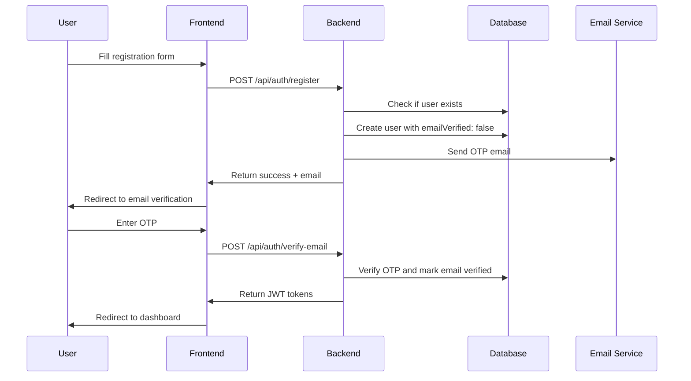
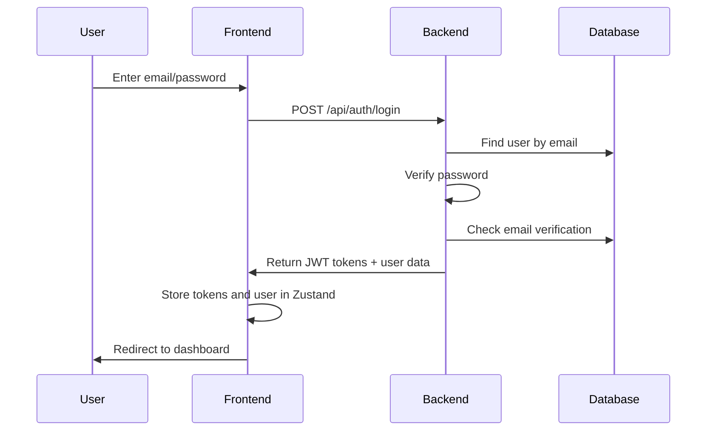
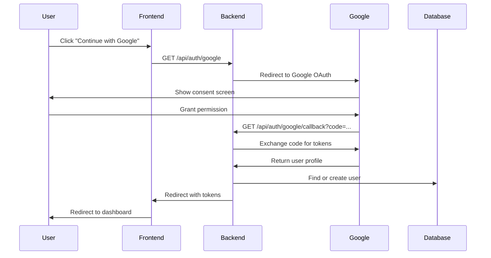
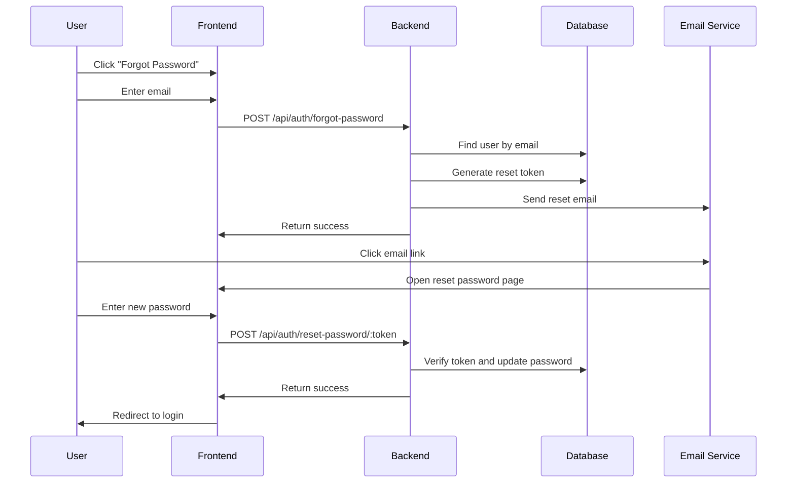

# Authentication System Documentation

## Table of Contents
1. [System Overview](#system-overview)
2. [Architecture](#architecture)
3. [Authentication Flow](#authentication-flow)
4. [Frontend Components](#frontend-components)
5. [Backend Services](#backend-services)
6. [Database Schema](#database-schema)
7. [API Endpoints](#api-endpoints)
8. [Features](#features)
9. [Setup Guide](#setup-guide)
10. [Code Examples](#code-examples)

## System Overview

This is a full-stack authentication system built with **React + TypeScript** frontend and **Node.js + Express + MongoDB** backend. It supports multiple authentication methods and provider linking.

### Key Features
- 🔐 **Multi-Provider Authentication**: Email/Password, Google OAuth, Email OTP
- 🔗 **Provider Linking**: Users can link multiple authentication methods
- 🛡️ **JWT Token Management**: Access tokens with refresh token rotation
- ✉️ **Email Verification**: OTP-based email verification
- 🔒 **Password Reset**: Secure password reset with email tokens
- 👤 **User Profile Management**: Complete profile management with avatar upload
- 🎯 **Enhanced UX**: Smart error handling and user guidance

### Technology Stack
**Frontend:**
- React 19 + TypeScript
- Vite (Build tool)
- TanStack Query v5 (Data fetching)
- Zustand (State management)
- React Router v6 (Routing)
- React Hook Form + Yup (Form handling)
- Tailwind CSS (Styling)
- Google Identity Services (OAuth)

**Backend:**
- Node.js + Express.js
- MongoDB + Mongoose
- JWT (JSON Web Tokens)
- Passport.js (Google OAuth)
- Bcrypt (Password hashing)
- Nodemailer (Email sending)
- Cloudinary (File uploads)

## Architecture

```
┌─────────────────┐    ┌─────────────────┐    ┌─────────────────┐
│   Frontend      │    │    Backend      │    │   Database      │
│   (React)       │    │   (Express)     │    │   (MongoDB)     │
│                 │    │                 │    │                 │
│ ┌─────────────┐ │    │ ┌─────────────┐ │    │ ┌─────────────┐ │
│ │ Components  │ │    │ │ Controllers │ │    │ │ Users       │ │
│ │ Pages       │ │◄──►│ │ Middleware  │ │◄──►│ │ Sessions    │ │
│ │ Services    │ │    │ │ Routes      │ │    │ │ Tokens      │ │
│ │ Stores      │ │    │ │ Models      │ │    │ │             │ │
│ └─────────────┘ │    │ └─────────────┘ │    │ └─────────────┘ │
└─────────────────┘    └─────────────────┘    └─────────────────┘
         │                       │                       │
         │                       │                       │
    ┌─────────┐            ┌─────────┐            ┌─────────┐
    │ Browser │            │ Server  │            │ MongoDB │
    │ Storage │            │ Memory  │            │ Atlas   │
    └─────────┘            └─────────┘            └─────────┘
```

## Authentication Flow

### 1. User Registration Flow



### 2. Login Flow



### 3. Google OAuth Flow



### 4. Password Reset Flow



## Frontend Components

### Core Components

#### 1. **AuthChecker.tsx**
```typescript
/**
 * Authentication checker component that runs on app initialization
 * Features:
 * - Checks for existing tokens in cookies
 * - Validates token freshness
 * - Handles automatic token refresh
 * - Sets up axios interceptors for token management
 */
const AuthChecker = ({ children }) => {
  const { login, logout } = useAuthStore();
  
  useEffect(() => {
    // Check for existing authentication
    const checkAuth = async () => {
      try {
        const response = await authService.getCurrentUser();
        login(response.user, getTokenFromCookie());
      } catch (error) {
        logout();
      }
    };
    
    checkAuth();
  }, []);
  
  return children;
};
```

#### 2. **LoginForm.tsx**
```typescript
/**
 * Enhanced login form with smart error handling
 * Features:
 * - Email/password authentication
 * - "Remember me" functionality
 * - Smart error detection for users with only Google provider
 * - Helpful UX messages with action buttons
 */
const LoginForm = () => {
  const [showPasswordNotSetMessage, setShowPasswordNotSetMessage] = useState(false);
  
  const loginMutation = useMutation({
    mutationFn: async (data) => {
      // Login API call
    },
    onError: (error, variables) => {
      // Enhanced error detection
      if (error.message?.includes('Password not set') || 
          errorData?.code === 'PASSWORD_NOT_SET') {
        setShowPasswordNotSetMessage(true);
        setUserEmailForPasswordSetup(variables.email);
      }
    }
  });
  
  // Smart UI that shows helpful options for Google users
  return (
    <form onSubmit={handleSubmit(onSubmit)}>
      {showPasswordNotSetMessage ? (
        <EnhancedErrorMessage 
          email={userEmailForPasswordSetup}
          onSetupPassword={() => navigate('/forgot-password')}
          onGoogleLogin={handleGoogleLogin}
        />
      ) : (
        <StandardErrorMessage error={loginMutation.error} />
      )}
    </form>
  );
};
```

#### 3. **GoogleSignInButton.tsx**
```typescript
/**
 * Reusable Google OAuth button component
 * Features:
 * - Google Identity Services integration
 * - Automatic token verification
 * - Error handling and loading states
 * - Configurable for login/signup contexts
 */
const GoogleSignInButton = ({ mode = 'login', onSuccess, onError }) => {
  useEffect(() => {
    // Initialize Google Identity Services
    const initializeGoogleSignIn = () => {
      if (window.google) {
        window.google.accounts.id.initialize({
          client_id: import.meta.env.VITE_GOOGLE_CLIENT_ID,
          callback: handleCredentialResponse,
          auto_select: false,
          cancel_on_tap_outside: true
        });
      }
    };
    
    const handleCredentialResponse = async (response) => {
      try {
        const result = await authService.verifyGoogleToken(response.credential);
        onSuccess?.(result);
      } catch (error) {
        onError?.(error);
      }
    };
  }, []);
};
```

#### 4. **ProtectedRoute.tsx**
```typescript
/**
 * Route protection component with automatic redirects
 * Features:
 * - Authentication state checking
 * - Loading state management
 * - Automatic redirect to login
 * - Preserve intended destination
 */
const ProtectedRoute = ({ children }) => {
  const { user, isLoading } = useAuthStore();
  const location = useLocation();
  
  if (isLoading) {
    return <LoadingSpinner />;
  }
  
  if (!user) {
    // Redirect to login with return URL
    return <Navigate to="/login" state={{ from: location }} replace />;
  }
  
  return children;
};
```

### Page Components

#### 1. **Profile.tsx**
```typescript
/**
 * Comprehensive user profile management page
 * Features:
 * - Profile information editing with validation
 * - Avatar upload with Cloudinary integration
 * - Dynamic password management (set/change based on providers)
 * - Provider management (link/unlink authentication methods)
 * - Real-time form validation with React Hook Form + Yup
 */
const Profile = () => {
  const profileForm = useForm<ProfileFormData>({
    resolver: yupResolver(profileSchema),
    defaultValues: {
      name: currentUser?.name || '',
      bio: currentUser?.bio || '',
      phone: currentUser?.phone || '',
      dateOfBirth: currentUser?.dateOfBirth || '',
      gender: currentUser?.gender || '',
      location: currentUser?.location || ''
    }
  });
  
  // Dynamic password schema based on user's providers
  const passwordSchema = useMemo(() => {
    const hasPassword = currentUser?.providers?.some(p => p.type === 'password');
    return hasPassword ? changePasswordSchema : setPasswordSchema;
  }, [currentUser?.providers]);
  
  // Profile update mutation with optimistic updates
  const updateProfileMutation = useMutation({
    mutationFn: authService.updateProfile,
    onSuccess: (data) => {
      updateUser(data.user);
      queryClient.invalidateQueries({ queryKey: ['profile'] });
    }
  });
};
```

#### 2. **EmailVerification.tsx**
```typescript
/**
 * Interactive email verification component
 * Features:
 * - 6-digit OTP input with auto-focus and navigation
 * - Countdown timer with resend functionality
 * - Paste support for OTP codes
 * - Auto-submit when complete
 * - Keyboard navigation (arrows, backspace)
 */
const EmailVerification = () => {
  const [otp, setOtp] = useState(['', '', '', '', '', '']);
  const [timeLeft, setTimeLeft] = useState(600); // 10 minutes
  const inputRefs = useRef<(HTMLInputElement | null)[]>([]);
  
  const handleInputChange = (index: number, value: string) => {
    // Handle paste operations
    if (value.length > 1) {
      const pastedCode = value.slice(0, 6).split('');
      const newOtp = [...otp];
      pastedCode.forEach((char, i) => {
        if (index + i < 6) newOtp[index + i] = char;
      });
      setOtp(newOtp);
      
      // Auto-submit if complete
      if (newOtp.every(digit => digit !== '')) {
        handleSubmit(newOtp);
      }
      return;
    }
    
    // Regular single character input
    const newOtp = [...otp];
    newOtp[index] = value;
    setOtp(newOtp);
    
    // Move to next input
    if (value && index < 5) {
      inputRefs.current[index + 1]?.focus();
    }
  };
};
```

## Backend Services

### Controllers

#### 1. **auth.controller.js**
```javascript
/**
 * Main authentication controller handling all auth operations
 * Features:
 * - Multi-provider user lookup (legacy email + new emails array)
 * - Enhanced password reset with provider management
 * - JWT token generation with refresh token rotation
 * - Email verification with OTP
 * - Google OAuth integration
 */

// Enhanced user lookup for multiple email structures
const findUserByEmail = async (email) => {
  return await User.findOne({ 
    $or: [
      { email: email.toLowerCase() },
      { 'emails.email': email.toLowerCase() }
    ]
  });
};

// Login with enhanced error handling
const login = async (req, res) => {
  try {
    const { email, password, rememberMe = false } = req.body;
    
    const user = await findUserByEmail(email);
    if (!user) {
      return res.status(401).json({ 
        success: false,
        message: 'Invalid credentials' 
      });
    }
    
    // Check if user has password provider
    const hasPassword = user.hasProvider('password') || user.password || user.passwordHash;
    if (!hasPassword) {
      return res.status(400).json({
        success: false,
        code: 'PASSWORD_NOT_SET',
        message: 'Password not set for this account. Please use Google sign-in or set up a password.'
      });
    }
    
    // Verify password and generate tokens
    const isPasswordMatch = await user.matchPassword(password);
    if (!isPasswordMatch) {
      return res.status(401).json({ 
        success: false,
        message: 'Invalid credentials' 
      });
    }
    
    // Generate JWT tokens
    const tokens = await tokenService.issueTokens(user._id, rememberMe);
    tokenService.setTokenCookies(res, tokens, rememberMe);
    
    res.status(200).json({
      success: true,
      accessToken: tokens.accessToken,
      user: user.getPublicProfile()
    });
  } catch (error) {
    console.error('Login error:', error);
    res.status(500).json({ 
      success: false,
      message: 'Server error during login' 
    });
  }
};

// Enhanced password reset with provider management
const resetPassword = async (req, res) => {
  try {
    const { token } = req.params;
    const { password } = req.body;
    
    // Find user with valid reset token
    const hashedToken = crypto.createHash('sha256').update(token).digest('hex');
    const user = await User.findOne({
      passwordResetToken: hashedToken,
      passwordResetExpires: { $gt: Date.now() }
    });
    
    if (!user) {
      return res.status(400).json({
        success: false,
        message: 'Invalid or expired reset token'
      });
    }
    
    // Update password (User model will handle hashing and provider addition)
    user.password = password;
    user.clearPasswordResetToken();
    await user.save();
    
    res.status(200).json({
      success: true,
      message: 'Password reset successful'
    });
  } catch (error) {
    console.error('Reset password error:', error);
    res.status(500).json({
      success: false,
      message: 'Server error during password reset'
    });
  }
};
```

#### 2. **user.controller.js**
```javascript
/**
 * User management controller
 * Features:
 * - Profile updates with validation
 * - Avatar upload with Cloudinary
 * - Provider linking/unlinking
 * - Password management
 */

const updateProfile = async (req, res) => {
  try {
    const userId = req.user._id;
    const updates = req.body;
    
    // Filter allowed fields
    const allowedUpdates = ['name', 'bio', 'phone', 'dateOfBirth', 'gender', 'location'];
    const filteredUpdates = {};
    
    allowedUpdates.forEach(field => {
      if (updates[field] !== undefined) {
        filteredUpdates[field] = updates[field];
      }
    });
    
    const user = await User.findByIdAndUpdate(
      userId,
      filteredUpdates,
      { new: true, runValidators: true }
    );
    
    res.status(200).json({
      success: true,
      user: user.getPublicProfile()
    });
  } catch (error) {
    console.error('Update profile error:', error);
    res.status(500).json({
      success: false,
      message: 'Server error during profile update'
    });
  }
};
```

### Models

#### 1. **User.js**
```javascript
/**
 * Enhanced User model with provider system
 * Features:
 * - Multi-provider authentication support
 * - Automatic password hashing
 * - Email management with verification
 * - Token management (reset, refresh)
 * - Provider linking methods
 */

const ProviderSchema = new mongoose.Schema({
  type: {
    type: String,
    enum: ['google', 'password', 'email-otp'],
    required: true
  },
  sub: String, // Google sub ID
  email: String,
  emailVerifiedAt: Date,
  linkedAt: { type: Date, default: Date.now }
}, { _id: false });

const UserSchema = new mongoose.Schema({
  name: { type: String, required: true },
  providers: [ProviderSchema],
  emails: [EmailEntrySchema],
  primaryEmail: { type: String, required: true },
  password: { type: String, select: false },
  avatar: String,
  // ... other fields
});

// Pre-save middleware for password hashing and provider management
UserSchema.pre('save', async function (next) {
  // Handle password hashing
  if (this.isModified('password') && this.password) {
    const salt = await bcrypt.genSalt(10);
    this.password = await bcrypt.hash(this.password, salt);
    
    // Add password provider if not exists
    if (!this.providers.find(p => p.type === 'password')) {
      this.providers.push({
        type: 'password',
        email: this.primaryEmail,
        linkedAt: new Date()
      });
    }
  }
  
  next();
});

// Provider management methods
UserSchema.methods.hasProvider = function(type) {
  return this.providers.some(p => p.type === type);
};

UserSchema.methods.addProvider = function(type, data = {}) {
  if (!this.hasProvider(type)) {
    this.providers.push({
      type,
      ...data,
      linkedAt: new Date()
    });
  }
};

UserSchema.methods.removeProvider = function(type) {
  this.providers = this.providers.filter(p => p.type !== type);
};
```

### Services

#### 1. **tokenService.js**
```javascript
/**
 * JWT token management service
 * Features:
 * - Access token generation with short expiry
 * - Refresh token rotation for security
 * - Cookie management with secure flags
 * - Token validation and refresh
 */

const issueTokens = async (userId, rememberMe = false) => {
  const accessTokenExpiry = rememberMe ? '7d' : '15m';
  const refreshTokenExpiry = rememberMe ? '30d' : '7d';
  
  const accessToken = jwt.sign(
    { userId },
    process.env.JWT_SECRET,
    { expiresIn: accessTokenExpiry }
  );
  
  const refreshToken = jwt.sign(
    { userId, type: 'refresh' },
    process.env.JWT_REFRESH_SECRET,
    { expiresIn: refreshTokenExpiry }
  );
  
  return {
    accessToken,
    refreshToken,
    expiresIn: rememberMe ? 7 * 24 * 60 * 60 : 15 * 60
  };
};

const setTokenCookies = (res, tokens, rememberMe) => {
  const maxAge = rememberMe ? 30 * 24 * 60 * 60 * 1000 : 7 * 24 * 60 * 60 * 1000;
  
  res.cookie('refreshToken', tokens.refreshToken, {
    httpOnly: true,
    secure: process.env.NODE_ENV === 'production',
    sameSite: 'strict',
    maxAge
  });
  
  res.cookie('rememberMe', rememberMe.toString(), {
    httpOnly: false,
    secure: process.env.NODE_ENV === 'production',
    sameSite: 'strict',
    maxAge
  });
};
```

#### 2. **providerService.js**
```javascript
/**
 * Provider management service
 * Features:
 * - User migration from legacy to new provider system
 * - Provider linking/unlinking operations
 * - Email verification for providers
 */

const migrateExistingUser = async (user) => {
  let hasChanges = false;
  
  // Migrate legacy email to new structure
  if (user.email && !user.primaryEmail) {
    user.primaryEmail = user.email;
    hasChanges = true;
  }
  
  // Ensure emails array exists
  if (!user.emails || user.emails.length === 0) {
    user.emails = [{
      email: user.primaryEmail,
      verified: user.emailVerified || false,
      isPrimary: true
    }];
    hasChanges = true;
  }
  
  // Add password provider if user has password but no provider
  if ((user.password || user.passwordHash) && !user.hasProvider('password')) {
    user.addProvider('password', { email: user.primaryEmail });
    hasChanges = true;
  }
  
  if (hasChanges) {
    await user.save();
  }
  
  return user;
};
```

## Database Schema

### User Document Structure
```javascript
{
  _id: ObjectId,
  name: "John Doe",
  primaryEmail: "john@example.com",
  
  // New provider-based system
  providers: [
    {
      type: "google",
      sub: "google_user_id",
      email: "john@example.com",
      emailVerifiedAt: ISODate,
      linkedAt: ISODate
    },
    {
      type: "password",
      email: "john@example.com",
      emailVerifiedAt: ISODate,
      linkedAt: ISODate
    }
  ],
  
  emails: [
    {
      email: "john@example.com",
      verified: true,
      verifiedAt: ISODate,
      isPrimary: true
    }
  ],
  
  password: "hashed_password", // bcrypt hashed
  avatar: "cloudinary_url",
  bio: "Software developer",
  phone: "+1234567890",
  dateOfBirth: ISODate,
  gender: "male",
  location: "New York, NY",
  
  // Token management
  refreshTokens: [
    {
      token: "hashed_refresh_token",
      expiresAt: ISODate
    }
  ],
  
  // Password reset
  passwordResetToken: "hashed_reset_token",
  passwordResetExpires: ISODate,
  
  // Email verification
  emailVerificationOTP: "hashed_otp",
  emailVerificationOTPExpires: ISODate,
  
  // Legacy fields (for backward compatibility)
  email: "john@example.com",
  emailVerified: true,
  
  createdAt: ISODate,
  updatedAt: ISODate
}
```

## API Endpoints

### Authentication Endpoints

| Method | Endpoint | Description | Auth Required |
|--------|----------|-------------|---------------|
| POST | `/api/auth/register` | Register new user with email/password | No |
| POST | `/api/auth/verify-email` | Verify email with OTP | No |
| POST | `/api/auth/resend-otp` | Resend email verification OTP | No |
| POST | `/api/auth/login` | Login with email/password | No |
| POST | `/api/auth/forgot-password` | Request password reset | No |
| POST | `/api/auth/reset-password/:token` | Reset password with token | No |
| GET | `/api/auth/me` | Get current user profile | Yes |
| POST | `/api/auth/refresh` | Refresh access token | No |
| POST | `/api/auth/logout` | Logout user | Yes |

### Google OAuth Endpoints

| Method | Endpoint | Description | Auth Required |
|--------|----------|-------------|---------------|
| GET | `/api/auth/google` | Initiate Google OAuth flow | No |
| GET | `/api/auth/google/callback` | Handle Google OAuth callback | No |
| POST | `/api/auth/google/verify` | Verify Google token (frontend) | No |

### Provider Management Endpoints

| Method | Endpoint | Description | Auth Required |
|--------|----------|-------------|---------------|
| POST | `/api/auth/providers/link/google` | Link Google account | Yes |
| DELETE | `/api/auth/providers/:type` | Unlink provider | Yes |

### User Management Endpoints

| Method | Endpoint | Description | Auth Required |
|--------|----------|-------------|---------------|
| GET | `/api/users/profile` | Get detailed user profile | Yes |
| PUT | `/api/users/profile` | Update user profile | Yes |
| POST | `/api/users/upload-avatar` | Upload profile avatar | Yes |
| POST | `/api/users/change-password` | Change user password | Yes |

## Features

### 1. Enhanced Login UX for Google Users

When a user who signed up with Google tries to login with email/password:

```typescript
// Frontend detects the "password not set" error
if (errorData?.code === 'PASSWORD_NOT_SET') {
  // Show helpful blue information box with two options:
  // 1. "Set up a password" - redirects to forgot password
  // 2. "Continue with Google" - starts Google OAuth
}
```

**User Experience:**
- Clear explanation: "You previously signed up using Google"
- Two action buttons with icons
- Pre-filled email in forgot password flow
- Seamless transition between auth methods

### 2. Dynamic Password Management

The system intelligently handles password operations based on user's providers:

```typescript
// Dynamic schema based on user's authentication providers
const passwordSchema = useMemo(() => {
  const hasPassword = user?.providers?.some(p => p.type === 'password');
  return hasPassword ? changePasswordSchema : setPasswordSchema;
}, [user?.providers]);

// Dynamic UI text
const buttonText = hasPassword ? 'Change Password' : 'Set Password';
const fieldLabel = hasPassword ? 'Current Password' : 'New Password';
```

### 3. Provider Linking System

Users can link multiple authentication methods:

```javascript
// Backend: Link Google account to existing user
const linkGoogle = async (req, res) => {
  const user = req.user;
  const { credential } = req.body;
  
  // Verify Google token
  const googleUser = await verifyGoogleToken(credential);
  
  // Check if Google account is already linked elsewhere
  const existingUser = await User.findOne({
    'providers.type': 'google',
    'providers.sub': googleUser.sub
  });
  
  if (existingUser && existingUser._id.toString() !== user._id.toString()) {
    return res.status(409).json({
      success: false,
      message: 'This Google account is already linked to another user'
    });
  }
  
  // Add Google provider
  user.addProvider('google', {
    sub: googleUser.sub,
    email: googleUser.email,
    emailVerifiedAt: new Date()
  });
  
  await user.save();
};
```

### 4. Email Verification System

Multi-step email verification with OTP:

```javascript
// Generate and send OTP
const generateEmailVerificationOTP = function() {
  const otp = Math.floor(100000 + Math.random() * 900000).toString();
  
  this.emailVerificationOTP = crypto
    .createHash('sha256')
    .update(otp)
    .digest('hex');
    
  this.emailVerificationOTPExpires = Date.now() + 10 * 60 * 1000; // 10 minutes
  
  return otp; // Return unhashed OTP for email
};

// Verify OTP
const verifyEmailOTP = function(otp) {
  const hashedOTP = crypto
    .createHash('sha256')
    .update(otp)
    .digest('hex');
    
  return this.emailVerificationOTP === hashedOTP && 
         this.emailVerificationOTPExpires > Date.now();
};
```

### 5. Secure Token Management

JWT tokens with refresh token rotation:

```javascript
// Token refresh with rotation
const refreshToken = async (req, res) => {
  const { refreshToken } = req.cookies;
  
  // Find user with this refresh token
  const user = await User.findOne({
    'refreshTokens.token': refreshToken,
    'refreshTokens.expiresAt': { $gt: new Date() }
  });
  
  if (!user) {
    return res.status(401).json({
      success: false,
      message: 'Invalid refresh token'
    });
  }
  
  // Generate new token pair
  const tokens = await tokenService.issueTokens(user._id, rememberMe);
  
  // Remove old refresh token and add new one
  await user.removeRefreshToken(refreshToken);
  await user.addRefreshToken(tokens.refreshToken, tokens.refreshTokenExpiry);
  
  // Set new cookies
  tokenService.setTokenCookies(res, tokens, rememberMe);
};
```

## Setup Guide

### Environment Variables

**Backend (.env):**
```env
# Database
MONGODB_URI=mongodb://localhost:27017/auth-boilerplate

# JWT Secrets
JWT_SECRET=your-super-secure-jwt-secret-key
JWT_REFRESH_SECRET=your-super-secure-refresh-secret-key

# Google OAuth
GOOGLE_CLIENT_ID=your-google-client-id
GOOGLE_CLIENT_SECRET=your-google-client-secret

# Email Configuration
SMTP_HOST=smtp.gmail.com
SMTP_PORT=587
SMTP_EMAIL=your-email@gmail.com
SMTP_PASSWORD=your-app-password

# Cloudinary (for file uploads)
CLOUDINARY_CLOUD_NAME=your-cloudinary-name
CLOUDINARY_API_KEY=your-cloudinary-key
CLOUDINARY_API_SECRET=your-cloudinary-secret

# URLs
CLIENT_URL=http://localhost:5173
SERVER_URL=http://localhost:5000
```

**Frontend (.env):**
```env
VITE_API_URL=http://localhost:5000
VITE_GOOGLE_CLIENT_ID=your-google-client-id
VITE_CLOUDINARY_CLOUD_NAME=your-cloudinary-name
```

### Installation

**Backend:**
```bash
cd server
npm install
npm run dev
```

**Frontend:**
```bash
cd client
npm install
npm run dev
```

### Google OAuth Setup

1. Go to [Google Cloud Console](https://console.cloud.google.com/)
2. Create a new project or select existing
3. Enable Google+ API
4. Create OAuth 2.0 credentials
5. Add authorized redirect URIs:
   - `http://localhost:5000/api/auth/google/callback` (development)
   - `https://yourdomain.com/api/auth/google/callback` (production)

### Email Setup (Gmail)

1. Enable 2-factor authentication on your Gmail account
2. Generate an app password
3. Use the app password in `SMTP_PASSWORD`

## Code Examples

### Frontend State Management (Zustand)

```typescript
interface AuthState {
  user: User | null;
  isAuthenticated: boolean;
  isLoading: boolean;
  login: (user: User, token: string) => void;
  logout: () => void;
  updateUser: (userData: Partial<User>) => void;
}

const useAuthStore = create<AuthState>((set, get) => ({
  user: null,
  isAuthenticated: false,
  isLoading: true,
  
  login: (user, token) => {
    localStorage.setItem('token', token);
    set({ user, isAuthenticated: true, isLoading: false });
  },
  
  logout: () => {
    localStorage.removeItem('token');
    set({ user: null, isAuthenticated: false, isLoading: false });
  },
  
  updateUser: (userData) => {
    const currentUser = get().user;
    if (currentUser) {
      set({ user: { ...currentUser, ...userData } });
    }
  }
}));
```

### API Service Layer

```typescript
import api from '../config/api';

export const authService = {
  register: async (userData: RegisterData) => {
    const response = await api.post('/api/auth/register', userData);
    return response.data;
  },
  
  login: async (credentials: LoginData) => {
    const response = await api.post('/api/auth/login', credentials);
    return response.data;
  },
  
  getCurrentUser: async () => {
    const response = await api.get('/api/auth/me');
    return response.data;
  },
  
  updateProfile: async (profileData: ProfileData) => {
    const response = await api.put('/api/users/profile', profileData);
    return response.data;
  },
  
  verifyGoogleToken: async (credential: string) => {
    const response = await api.post('/api/auth/google/verify', { credential });
    return response.data;
  }
};
```

### Form Validation Schemas

```typescript
import * as yup from 'yup';

export const profileSchema = yup.object({
  name: yup.string()
    .required('Name is required')
    .min(2, 'Name must be at least 2 characters'),
    
  bio: yup.string()
    .max(500, 'Bio must be less than 500 characters'),
    
  phone: yup.string()
    .matches(/^[\+]?[1-9][\d]{0,15}$/, 'Invalid phone number'),
    
  dateOfBirth: yup.date()
    .max(new Date(), 'Date of birth cannot be in the future')
    .nullable(),
    
  gender: yup.string()
    .oneOf(['male', 'female', 'other', ''], 'Invalid gender'),
    
  location: yup.string()
    .max(100, 'Location must be less than 100 characters')
});

export const changePasswordSchema = yup.object({
  currentPassword: yup.string()
    .required('Current password is required'),
    
  newPassword: yup.string()
    .required('New password is required')
    .min(8, 'Password must be at least 8 characters')
    .matches(
      /^(?=.*[a-z])(?=.*[A-Z])(?=.*\d)/,
      'Password must contain uppercase, lowercase, and number'
    ),
    
  confirmPassword: yup.string()
    .required('Please confirm your password')
    .oneOf([yup.ref('newPassword')], 'Passwords must match')
});
```

### Error Handling

```typescript
// Global error handler with toast notifications
const handleApiError = (error: any) => {
  if (error.response?.status === 401) {
    // Unauthorized - redirect to login
    useAuthStore.getState().logout();
    toast.error('Session expired. Please login again.');
    window.location.href = '/login';
  } else if (error.response?.status === 403) {
    // Forbidden
    toast.error('You do not have permission to perform this action.');
  } else if (error.response?.status >= 500) {
    // Server error
    toast.error('Server error. Please try again later.');
  } else {
    // Other errors
    const message = error.response?.data?.message || error.message || 'An error occurred';
    toast.error(message);
  }
};

// Axios interceptor for global error handling
api.interceptors.response.use(
  (response) => response,
  (error) => {
    handleApiError(error);
    return Promise.reject(error);
  }
);
```

This documentation provides a comprehensive overview of the authentication system, including architecture, flows, components, and implementation details. The system is designed to be secure, scalable, and user-friendly with modern authentication patterns and best practices.
